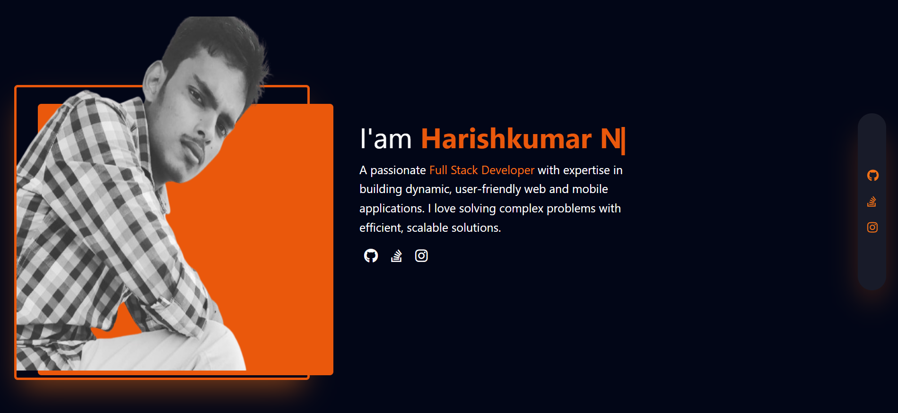

# Harishkumar N - Portfolio Website

Welcome to my personal portfolio website! This site showcases my skills, projects, and contact information as a Full Stack Developer.

## Live Demo

Check out the live version of my portfolio [here](https://your-website-link.com).

## Table of Contents

- [About](#about)
- [Features](#features)
- [Technologies](#technologies)
- [Installation](#installation)
- [Usage](#usage)
- [Projects](#projects)
- [Contact](#contact)
- [License](#license)

## About

I'm Harishkumar N, a Full Stack Developer with experience in building web applications using modern technologies like React, Node.js, Express.js, and MongoDB. This portfolio website provides a glimpse into my skills, projects, and how to get in touch with me.

## Features

- Responsive design for mobile and desktop.
- Showcase of projects with descriptions and links.
- Skill highlights and technologies I work with.
- Contact information with links to GitHub and LinkedIn profiles.

## Technologies

- **Frontend**: HTML, CSS (TailwindCSS), JavaScript
- **Backend**: None (static site)
- **Tools**: Git, GitHub Pages (for deployment)

## Installation

To set up this project locally, follow these steps:

1. **Clone the repository**:
   ```bash
   git clone https://github.com/HARISHKUMAR023/portfolio-website.git
